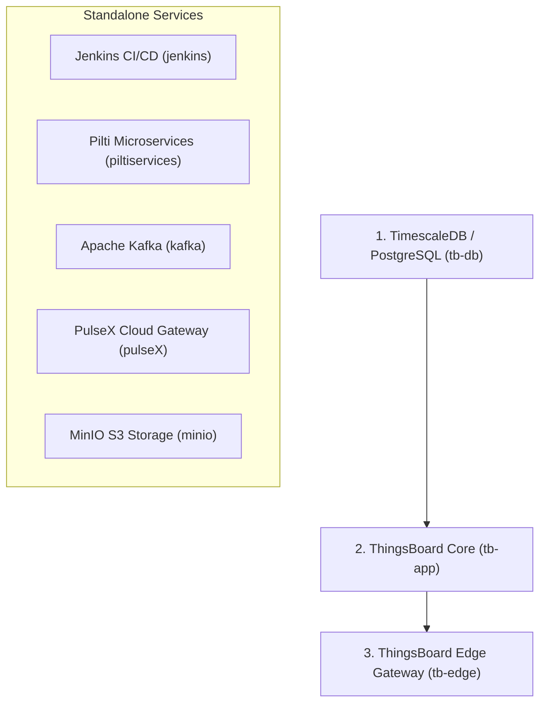

# PiltiSmart Enterprise CLI (`pilti cli`) & Software Catalog

A standalone, zero-dependency cloud-native CLI written in **Go** using the **Cobra Framework** to discover, configure, inspect, and orchestrate all software components and microservices across the **PiltiSmart** ecosystem:

1. `tb-db` : TimescaleDB / PostgreSQL database (**Install 1st**)
2. `tb-app` : ThingsBoard Core Application (**Requires `tb-db`**)
3. `tb-edge` : ThingsBoard Edge Gateway (**Requires `tb-app`**)
4. `jenkins` : Jenkins CI/CD Automation Engine
5. `piltiservices` : PiltiSmart Microservices Backend
6. `kafka` : Apache Kafka Distributed Streaming Broker
7. `pulseX` : PulseX Cloud Gateway & Sync Tunnel (PMX - formerly `pilticloud`)
8. `minio` : MinIO S3-Compatible Distributed Object Storage Server

---

## ⚡ 1-Line Package Installation

Deploy the compiled `pilti` CLI binary and its integrated MinIO Client (`mc`) engine automatically onto any system with a single command:

### 🐧 Linux & 🍎 macOS (Bash / Zsh)
Run in your terminal:
```bash
curl -fsSL https://raw.githubusercontent.com/PiltiSmart/tb-stack-ps-cli/main/install.sh | bash
```

### 🪟 Windows (PowerShell)
Open PowerShell and run:
```powershell
irm https://raw.githubusercontent.com/PiltiSmart/tb-stack-ps-cli/main/install.ps1 | iex
```

> **What the 1-Line Installers Do Automatically:**
> - Detects operating system (Linux, macOS Darwin, Windows) and CPU architecture (`amd64`, `arm64`).
> - Downloads the latest release binary from GitHub Releases into the system binary path (`/usr/local/bin/pilti` or `%LOCALAPPDATA%\Programs\pilti\pilti.exe`).
> - Automatically installs the MinIO Client (`mc` / `mc.exe`) for full AWS S3-compatible cloud storage operations.
> - Configures environment `PATH` variables so `pilti` is immediately accessible globally.
> - Verifies the installation by executing `pilti version`.

---

## 🚀 Available Software Catalog & Versions

All software components in the PiltiSmart catalog can be viewed live using `pilti list` (or `pilti ls`):

| Software ID | Software Name | Category | Version | Default Ports | Dependencies | Description |
|---|---|---|---|---|---|---|
| **[`tb-db`](stacks/tb-db/)** | TimescaleDB / PostgreSQL | Database | `pg17` | `5432` | *None* (**Install 1st**) | High-performance telemetry & relational time-series database |
| **[`tb-app`](stacks/tb-app/)** | ThingsBoard Core Application | Core IoT | `v-4.1.2` | `8080`, `1883` | **`tb-db`** | ThingsBoard enterprise IoT server & device orchestrator |
| **[`tb-edge`](stacks/tb-edge/)** | ThingsBoard Edge Gateway | Edge Computing | `3.9.1EDGE` | `8082`, `1884` | **`tb-app`** | Autonomous ThingsBoard Edge instance for remote sites |
| **[`jenkins`](stacks/jenkins/)** | Jenkins CI/CD Automation | DevOps & CI/CD | `lts` | `8085`, `50000` | *None* | Automated build, test, and release controller engine |
| **[`piltiservices`](stacks/piltiservices/)** | PiltiSmart Microservices | Backend Services | `v7.10.7` | `9000` | *None* | Modular PiltiSmart specialized API backend services |
| **[`kafka`](stacks/kafka/)** | Apache Kafka Broker | Message Streaming | `4.1.1` | `9092` | *None* | KRaft distributed event streaming & message broker |
| **[`pulseX`](stacks/pulsex/)** | PulseX Cloud Gateway | Cloud Platform | `v8.4.41` *(Dynamic Git Selector)* | `8088` | *None* | Hybrid cloud synchronization connector & tunnel (PMX) |
| **[`minio`](stacks/minio/)** | MinIO Object Storage | Cloud Storage | `latest` | `9000`, `9001` | *None* | High-performance S3-compatible object storage server & console |

---

## 🛑 Installation Workflow & Dependency Hierarchy

ThingsBoard components **must** be deployed in prerequisite order. If a prerequisite dependency is missing, `pilti` prevents broken deployments and displays the exact requirement:



### Step 1: Deploy TimescaleDB Database (`tb-db`) — Install 1st
`pilti` prompts for your PostgreSQL username and password (defaults to `postgres`), dynamically updating the container configuration:
```bash
pilti install tb-db
# or: pilti tb-db install

# Non-interactive / scripted with custom credentials:
pilti tb-db install --db-user postgres --db-password mysecurepassword -y
```

### Step 2: Deploy ThingsBoard Core Application (`tb-app`) — Install 2nd
> **Prerequisite:** `tb-db` must be running!
```bash
pilti install tb-app
# or: pilti tb-app install
```
*If `tb-db` is not running, the installer halts with an alert:*
```text
[✖] Cannot install 'ThingsBoard Core Application' (tb-app): Missing required prerequisite!
[✖] Prerequisite dependency 'TimescaleDB / PostgreSQL' (tb-db) is NOT running (Current status: NOT INSTALLED).
```

### Step 3: Deploy ThingsBoard Edge Gateway (`tb-edge`) — Install 3rd
> **Prerequisite:** `tb-app` (and `tb-db`) must be running!
```bash
pilti install tb-edge
# or: pilti tb-edge install
```

---

## 📦 Deploying Standalone Enterprise Software

The following services have no inter-dependencies and can be deployed at any time:

```bash
# Jenkins CI/CD Controller
pilti install jenkins
# or: pilti jenkins install

# Apache Kafka Distributed Event Streaming Broker
pilti install kafka
# or: pilti kafka install

# PiltiSmart Microservices Backend
pilti install piltiservices
# or: pilti piltiservices install

# PulseX Cloud Gateway (PMX - formerly PiltiCloud)
pilti install pulseX
# or: pilti pulseX install (also accepts aliases: pilticloud, pmx, cloud)

# MinIO S3-Compatible Object Storage Server
pilti install minio
# or: pilti minio install (also accepts alias: minio-server)
```

---

## 🛠️ CLI Command Reference

### 1. View Software Catalog & Live Status
```bash
pilti list
# or
pilti ls
```
Displays all software components with versions, ports, and real-time container states:
```text
==================================================================

  ____  ___ _     _____ ___     ____ _     ___ 
 |  _ \|_ _| |   |_   _|_ _|   / ___| |   |_ _|
 | |_) || || |     | |  | |   | |   | |    | | 
 |  __/ | || |___  | |  | |   | |___| |___ | | 
 |_|   |___|_____| |_| |___|   \____|_____|___|

  PiltiSmart Software Catalog
==================================================================
Available PiltiSmart software components:
------------------------------------------------------------------------------------------------------------
SOFTWARE ID    SOFTWARE NAME                CATEGORY         VERSION       PORTS              STATUS
------------------------------------------------------------------------------------------------------------
tb-db          TimescaleDB / PostgreSQL     Database         pg17          5432               RUNNING
tb-app         ThingsBoard Core Application Core IoT         v-4.1.2       8080, 1883         RUNNING
tb-edge        ThingsBoard Edge Gateway     Edge Computing   3.9.1EDGE     8082, 1884         NOT INSTALLED
jenkins        Jenkins CI/CD Automation     DevOps & CI/CD   lts           8085, 50000        NOT INSTALLED
piltiservices  PiltiSmart Microservices     Backend Services v7.10.7       9000               NOT INSTALLED
kafka          Apache Kafka Broker          Message Streaming 4.1.1        9092               NOT INSTALLED
pulseX         PulseX Cloud Gateway         Cloud Platform   v8.4.41       8088               RUNNING
minio          MinIO Object Storage         Cloud Storage    latest        9000, 9001         RUNNING
------------------------------------------------------------------------------------------------------------
```

### 2. Interactive Software Picker
Launch an interactive arrow-key selector to choose software and operations:
```bash
pilti install
```

### 3. Service Lifecycle Management
Manage any software component directly using its `SOFTWARE ID`:

```bash
# Check status
pilti <software-id> status       # e.g., pilti pulseX status, pilti tb-db status

# Stream container logs
pilti <software-id> logs -f      # e.g., pilti minio logs -f, pilti kafka logs -f

# Restart container
pilti <software-id> restart      # e.g., pilti tb-app restart, pilti jenkins restart

# Stop container
pilti <software-id> stop         # e.g., pilti minio stop

# Remove container
pilti <software-id> remove       # e.g., pilti piltiservices remove
```

### 4. Interactive Port Checking & Port Customization
When installing any software, `pilti` automatically:
1. Displays the default host port (e.g., `Default Port: 8088`).
2. Prompts the technical user `Use this port? [Y/n]`.
3. If `n`, prompts for a custom port.
4. Performs a live TCP socket test on the target machine to verify that the port is free. If the port is already in use by another process, `pilti` warns you and asks for an alternate port before deploying.

For automated/scripted installs, pass `--port <number>` and `-y`:
```bash
pilti pulseX install --port 8089 -y
```

### 5. Dynamic GitHub Version Selector (`pulseX`)
When installing `pulseX` (formerly `pilticloud`), `pilti` dynamically queries GitHub Releases and Docker registries to present all available release tags (e.g., `v8.4.41`, `v8.4.38`, `v8.4.4`, `latest`) in an interactive picker or accepts custom version tags:
```bash
pilti pulseX install --version v8.4.41 -y
```

### 6. Environment File Configuration Alerts (`.env` / Infisical)
Whenever a software uses an environment configuration file (such as `.tb.env`, `.pmx.env`, `.piltiservices.env`), `pilti` displays alerts:
- **During installation:** Displays `.env manually paste`.
- **Upon completion:** Displays an alert banner detailing the exact path to paste your secrets:
```text
🔔 [ENVIRONMENT CONFIGURATION REQUIRED]
  .env manually paste #installation is done plz update .env (infisical file)
  --> Target File : /opt/piltismart/softwares/pulsex/.pmx.env
  After updating credentials, restart service: pilti pulseX restart
```

### 7. Pre-Flight System Diagnostics
Verifies Docker daemon status, Compose plugin, available RAM, disk capacity, and network ports:
```bash
pilti doctor
```

### 8. CLI Version & Runtime Info
```bash
pilti version
```

---

## 🪣 AWS S3 Cloud Storage CLI (`pilti s3`)

`pilti` includes a native AWS S3-compatible cloud storage CLI powered by the **MinIO Client (`mc`)** engine. It supports remote or local MinIO instances, AWS S3, or any S3-compatible endpoint.

### S3 Command Overview
```bash
pilti s3 --help
```

### Interactive MinIO S3 Connection (`pilti s3 ls`)
Running `pilti s3 ls` interactively prompts for:
1. **Server IP or Hostname** (default: `localhost`)
2. **Server Port** (displays `Default Port: 9000` first, then asks `[Y/n]` or accepts custom port)
3. **Access Key / Username** (default: `minioadmin`)
4. **Secret Key / Password** (default: `minioadmin123`)

For scripted connections:
```bash
# Connect to specific host & port
pilti s3 ls --host 192.168.1.100 --port 9000 -u minioadmin -p minioadmin123

# Fast-connect with local defaults without interactive prompts
pilti s3 ls -y
```

### S3 Command Reference

| Command | Usage | Description |
|---|---|---|
| `pilti s3 ls` | `pilti s3 ls [s3://bucket]` | List S3 buckets or objects inside a bucket |
| `pilti s3 mb` | `pilti s3 mb s3://mybucket` | Create a new S3 bucket |
| `pilti s3 rb` | `pilti s3 rb s3://mybucket [--force]` | Remove an S3 bucket |
| `pilti s3 cp` | `pilti s3 cp ./file.txt s3://mybucket/` | Upload or download files |
| `pilti s3 cp -r` | `pilti s3 cp ./folder s3://mybucket/folder -r` | Recursively copy directories |
| `pilti s3 cat` | `pilti s3 cat s3://mybucket/file.json` | View object contents in terminal |
| `pilti s3 stat` | `pilti s3 stat s3://mybucket/file.txt` | View object size, ETag, and metadata |
| `pilti s3 sync` | `pilti s3 sync ./data s3://mybucket/data` | Synchronize local folder with S3 bucket |
| `pilti s3 rm` | `pilti s3 rm s3://mybucket/file.txt` | Delete an object from an S3 bucket |
| `pilti s3 setup` | `pilti s3 setup` | Verify and configure MinIO client alias |
| `pilti s3 config` | `pilti s3 config` | Display active S3 endpoint and credentials |

---

## 🛡️ License

Copyright © 2026 PiltiSmart Solutions. All rights reserved.
